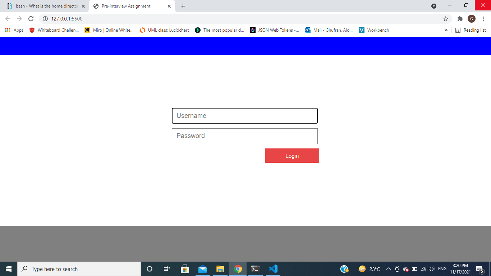

# Ghofran-Dayyat-FullStack-JavaScript-Nov-17-2021

## QUESTION 1 – SQL
1. Count number of products

        SELECT COUNT(productName) FROM Products 

2. Get least expensive product name and price

        SELECT Products.ProductName , ProductsPrice.ProductPrice 

        FROM Products INNER JOIN ProductsPrice ON Products.ProductID = ProductsPrice.ProductID 

        WHERE ProductsPrice.ProductPrice = (SELECT min(ProductPrice) FROM ProductsPrice)

3.  Count number of products with price less than 5  

        SELECT COUNT(*) 

        FROM Products INNER JOIN ProductsPrice ON Products.ProductID = ProductsPrice.ProductID 

        WHERE ProductsPrice.ProductPrice < 5
---
## QUESTION 2 – LOGIC

1.  Takes an array as parameter and prints out all products starting with any of these 
letters (A,E,I,O,U)

        const printWord = ((array)=>{

            let neededChar = ['A','E','I','O','U'];

            let firstChar ;  

            for ( let i = 0 ; i < array.length ; i++){

                firstChar = array[i][0] ;

                if(neededChar.includes(firstChar)) console.log(array[i]) ;

            }

        })

**Run ===> ``printWord(['Apple', 'Banana', 'Cucumber', 'Watermelon', 'Ice-cream', 'Orange', 'Eggplant', 'Egg']) ``**

2.  Takes an array as parameter and prints out all products with names longer than 5 
characters

        const printWord = ((array)=>{

            let numberOfChar ;

            for ( let i = 0 ; i < array.length ; i++){

                numberOfChar = array[i].split('').length ;

                if( numberOfChar > 5) console.log(array[i]) ;

            }

        })

**Run ===> ``printWord(['Apple', 'Banana', 'Cucumber', 'Watermelon', 'Ice-cream', 'Orange', 'Eggplant', 'Egg']) ``**

---
## QUESTION 3 – HTML & CSS
[Deploy to GitHub](https://ghofrandayyat.github.io/Ghofran-Dayyat-FullStack-JavaScript-Nov-17-2021/)

